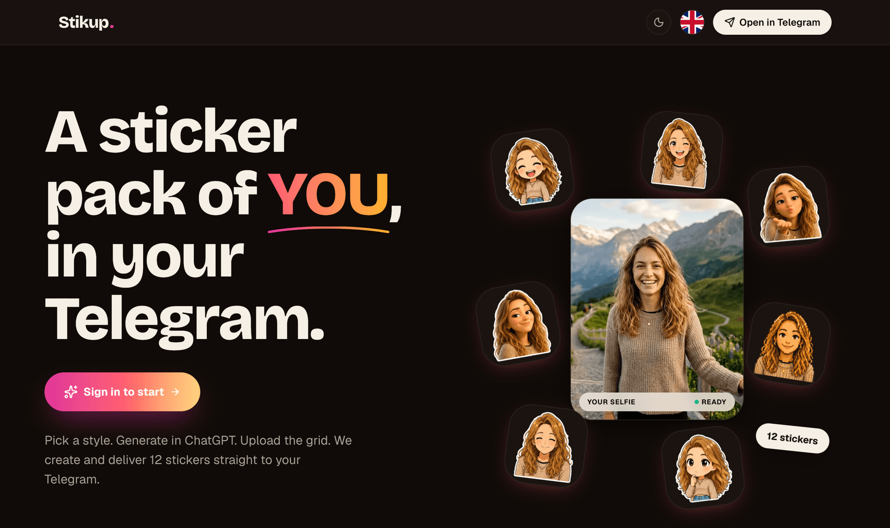
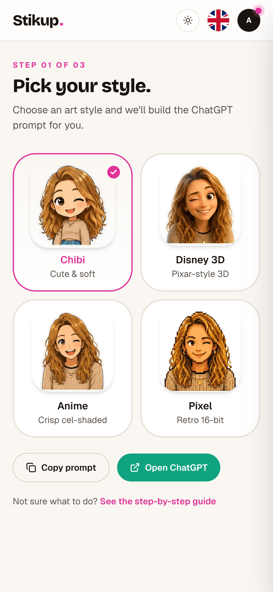
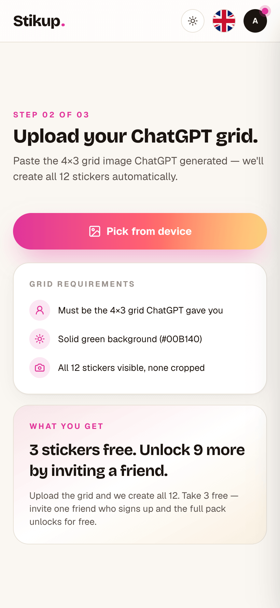
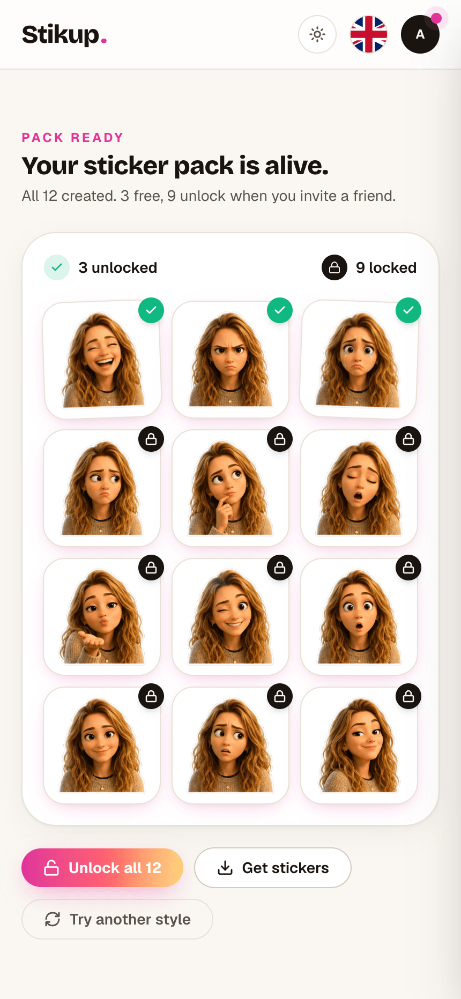
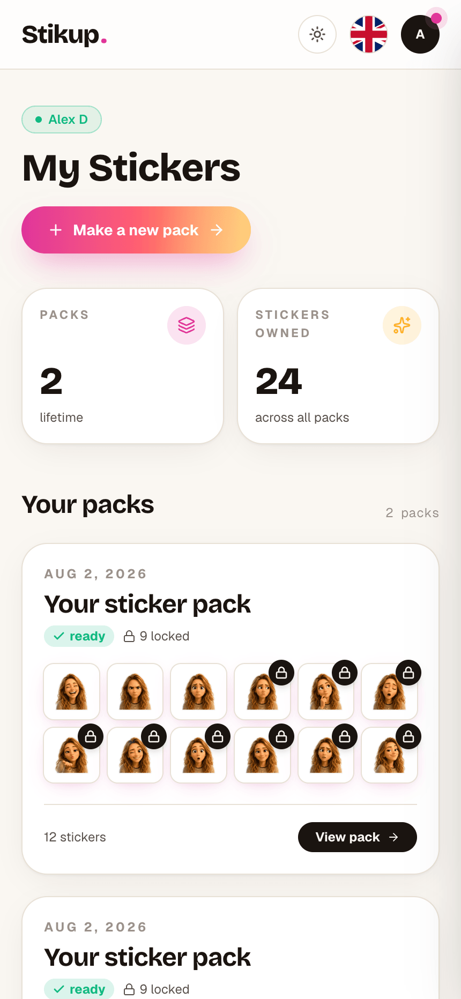
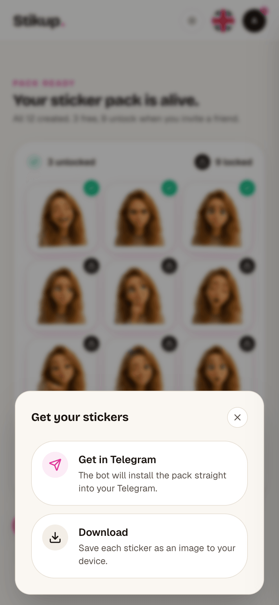
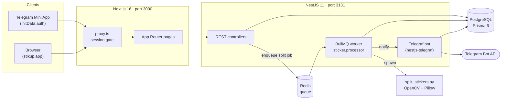

<div align="center">



### A sticker pack of **YOU**, in your Telegram

**Live:** [stikup.app](https://stikup.app) · **Bot:** [@stikup_bot](https://t.me/stikup_bot)

</div>

---

## What is StikUp?

StikUp turns a **ChatGPT-generated sticker sheet** into a **real Telegram sticker set**.

The app runs **no image generation of its own**. The user generates the artwork in their own ChatGPT account using a prompt we hand them, then uploads the result. Our job is everything after that — the fiddly part:

1. Cut the 4×3 grid into 12 cells
2. Chroma-key the green (`#00B140`) background to transparent and kill green spill
3. Encode Telegram-spec WebP stickers
4. Create a sticker set the user owns and DM them the install link

No AI bills, no payments, no subscriptions.

> **Heads up:** `docs/PRD.md` predates two pivots. The behaviour described below is what the **code** does today (see [Product rules](#product-rules-that-surprise-people)).

---

## The flow

|                                       1 · Pick a style                                       |                                        2 · Upload the sheet                                        |                               3 · Get your pack                                |
| :------------------------------------------------------------------------------------------: | :------------------------------------------------------------------------------------------------: | :----------------------------------------------------------------------------: |
|                      |                             |    |
| `/create` builds a copy-paste ChatGPT prompt from a fixed template + the chosen style block. | `/upload` takes the single grid image ChatGPT returned (max 8 MB). A rewarded ad gates processing. | `/result/[packId]` shows 12 stickers — 3 unlocked, 9 locked behind a referral. |

|                                       Pack library                                        |                                          Delivery sheet                                          |
| :---------------------------------------------------------------------------------------: | :----------------------------------------------------------------------------------------------: |
|              |               |
| `/my-stickers` lists every pack with its `PackStatus`: `generating` → `ready` / `failed`. | "Get in Telegram" makes the bot call `createNewStickerSet` and DM the `t.me/addstickers/…` link. |

> 🖼️ These are real captures of the app — see [Screenshots](#screenshots) for how they were taken and how to refresh them.

---

## Architecture



**Pack lifecycle:** `POST /packs` (multipart grid upload, 8 MB cap) validates and persists the pack as `generating`, then enqueues a job. The worker shells out to `split_stickers.py --grid`, writes 12 WebPs to the sticker storage dir, and flips the pack to `ready` — or `failed` if the grid can't be cut cleanly. The bot then delivers the set.

**Locked stickers are enforced server-side.** `StickerFileController` (`/static/packs/:packId/:filename`) checks ownership _and_ unlock state on every request — the 9 locked WebPs are never world-readable, so the lock isn't a CSS blur you can dodge with devtools.

---

## Repo layout

```
stickup-beta/
├── backend/                 # NestJS 11 API + Telegram bot + queue worker
│   ├── prisma/schema.prisma # User, ChannelIdentity, Session, Pack, Sticker, Referral…
│   ├── python/              # split_stickers.py + requirements.txt
│   └── src/
│       ├── admin/           # /userscount + failure alerts (gated by ADMIN_TELEGRAM_ID)
│       ├── auth/            # sessions, Google OAuth, Telegram initData, channel linking
│       ├── config/          # typed config namespaces (app, offer, storage, profile…)
│       ├── image-processing/# wraps the Python splitter
│       ├── jobs/            # cron: auth cleanup, pack reaper, health watchdog
│       ├── pack/            # pack CRUD, upload, gated sticker file serving
│       ├── queue/           # BullMQ queue + sticker.processor
│       ├── referral/        # invite codes, pending referrals
│       └── telegram/        # Telegraf update handlers, i18n, avatars
├── frontend/                # Next.js 16 (App Router) + React 19 + Tailwind 4
│   └── src/
│       ├── app/             # /create, /upload, /result/[packId], /my-stickers, /settings…
│       ├── i18n/messages/   # en + ru
│       ├── lib/             # api client, redux store, config
│       └── proxy.ts         # Next 16 middleware — validates the session upstream
├── shared/                  # generated OpenAPI schema + types
├── docs/                    # PRD, architecture, deployment guide, design specs
├── scripts/                 # server-bootstrap.sh, deploy.sh
├── docker-compose.dev.yml   # Postgres + Redis for local dev
├── docker-compose.prod.yml  # full prod stack + Caddy + nightly backup
└── Caddyfile                # auto-HTTPS reverse proxy
```

---

## Quick start

### Prerequisites

|                    | Version    | Notes                                      |
| ------------------ | ---------- | ------------------------------------------ |
| Node               | **22**     | pinned in `.nvmrc`; `nvm use`              |
| Docker             | any recent | for local Postgres + Redis                 |
| Python             | 3.11+      | only if you run the backend outside Docker |
| Telegram bot token | —          | from [@BotFather](https://t.me/BotFather)  |

### 1 · Install

```bash
nvm use
npm ci                                    # installs both workspaces
pip install -r backend/python/requirements.txt   # numpy, opencv-headless, Pillow
```

### 2 · Configure

Env files are loaded **most-specific first, first match wins**:

```
.env.<env>.local    real secrets      (gitignored — you create these)
.env.<env>          committed template (placeholders)
.env                legacy fallback    (gitignored)
```

`<env>` comes from `APP_ENV` (falling back to `NODE_ENV`). `.env.example` documents every variable.

```bash
cp .env.example .env.development.local   # then fill in your real values
```

For local dev you only really need `TELEGRAM_BOT_TOKEN` and the `GOOGLE_*` pair — everything else has a working default in the committed `.env.development`.

> ⚠️ **Gotcha:** the Prisma scripts load `-e ../.env` **only** (not the per-env files). Make sure a root `.env` exists with a valid `DATABASE_URL` or `prisma:migrate` will fail even though `npm run dev` works fine.

> ⚠️ **Gotcha:** keep `TELEGRAM_BOT_LAUNCH=false` locally. Telegram allows one long-poller per token — starting a second one 409s against the live bot. Sending still works with it off.

### 3 · Run

```bash
docker compose -f docker-compose.dev.yml up -d   # Postgres + Redis (loopback-only)
npm run -w backend prisma:generate
npm run -w backend prisma:migrate
npm run dev                                       # backend :3131 + frontend :3000
```

Open <http://localhost:3000>. API docs (when enabled for the profile) are at <http://localhost:3131/api-docs>.

---

## Scripts

**Root** (fan out to both workspaces)

| Command             | Does                                                    |
| ------------------- | ------------------------------------------------------- |
| `npm run dev`       | backend + frontend concurrently, hot reload             |
| `npm run build`     | build backend then frontend                             |
| `npm run typecheck` | `tsc --noEmit` in both                                  |
| `npm run lint`      | ESLint in both                                          |
| `npm run openapi`   | dump the OpenAPI doc → regenerate `shared/openapi.d.ts` |

**Backend** (`npm run -w backend <script>`)

| Command                            | Does                            |
| ---------------------------------- | ------------------------------- |
| `start:dev`                        | Nest watch mode                 |
| `test` / `test:cov`                | Jest unit tests (21 spec files) |
| `test:e2e`                         | Jest e2e config                 |
| `prisma:migrate` / `prisma:deploy` | dev migration / prod migration  |
| `prisma:studio`                    | Prisma Studio                   |

**Frontend** (`npm run -w frontend <script>`)

| Command               | Does                        |
| --------------------- | --------------------------- |
| `dev`                 | Next dev server (Turbopack) |
| `test` / `test:watch` | Vitest (27 test files)      |
| `e2e`                 | Playwright                  |

---

## API surface

No global prefix — routes sit at the backend root.

| Method          | Route                                          | Purpose                                             |
| --------------- | ---------------------------------------------- | --------------------------------------------------- |
| `GET`           | `/health`                                      | Terminus health check (used by the external pinger) |
| `GET`           | `/config/offer`                                | pack size + free sticker count for the client       |
| `POST`          | `/auth/register` · `/auth/login`               | email/password (argon2), rate-limited               |
| `GET`           | `/auth/google/start` · `/auth/google/callback` | Google OAuth                                        |
| `POST`          | `/auth/telegram/webapp`                        | Mini App `initData` HMAC exchange                   |
| `GET` `DELETE`  | `/auth/me`                                     | current session / delete account                    |
| `POST` `DELETE` | `/auth/link/telegram/*` · `/auth/link/google`  | channel linking                                     |
| `GET` `POST`    | `/packs`                                       | list packs / upload a grid (multipart, 8 MB cap)    |
| `GET` `DELETE`  | `/packs/:packId`                               | pack detail / delete                                |
| `POST`          | `/packs/:packId/deliver-telegram`              | create + send the sticker set                       |
| `POST`          | `/packs/:packId/download` · `/claim-free`      | download bundle / claim the 3 free                  |
| `GET`           | `/static/packs/:packId/:filename`              | **gated** sticker file serving                      |
| `GET`           | `/referral/me`                                 | invite code + referral state                        |
| `GET`           | `/telegram/avatar/:channelUserId`              | proxied Telegram profile photo                      |

**Bot commands:** `/start` (handles `?start=ref_<CODE>_<PACKID>` deep links), `/receive`, and `/userscount` (admin only, requires `ADMIN_TELEGRAM_ID`).

---

## The splitter

`backend/python/split_stickers.py` is the only non-JS piece. Given a grid image it:

- chroma-keys HSV range `[35,40,40]–[85,255,255]` to alpha, with morphological open/close cleanup
- suppresses green spill on sticker edges (`g > b && g > r` → clamp)
- rejects a cell whose keyed content isn't centred within `CENTER_MARGIN = 0.18`, so a misaligned sheet **fails the pack** instead of shipping half-cropped stickers

```bash
# how the worker calls it: geometric 3-row × 4-col tiling, 512 px WebP output
python3 backend/python/split_stickers.py grid.png -o ./out --grid
```

Flags: `--rows` (3), `--cols` (4), `--size` (512), and `--grid` to force deterministic geometric tiling instead of content-based blob detection.

Deps are pinned in `backend/python/requirements.txt` (`numpy`, `opencv-python-headless`, `Pillow`) and installed into the backend image at build time.

---

## Product rules that surprise people

These differ from what a quick skim of `docs/PRD.md` would tell you:

- **Generations are unlimited.** The old quota (and the `ad_rewards` table) was removed. Instead, **one rewarded Adsgram ad gates every generation** — the client calls `showRewarded()` before `POST /packs`. No ad, no pack.
- **Unlock is per-pack, not per-account.** Each pack's 9 locked stickers open only when a friend registers through _that pack's_ invite link (`?start=ref_<CODE>_<PACKID>` → `packs.unlocked_at`).
- **Referrals use a bot deep link, not `startapp`.** `?startapp=` only delivers `start_param` when a Main Mini App is configured in BotFather — it isn't. The bot deep link records a `PendingReferral` on `/start`, consumed at registration.
- **Web is gated to "Open in Telegram."** The browser entry point exists but funnels users into the Mini App.
- **No payments anywhere.** Non-commercial by design.

---

## Testing & quality gates

```bash
npm run typecheck              # both workspaces
npm run lint                   # both workspaces
npm run -w backend test        # Jest
npm run -w frontend test       # Vitest
npm run -w frontend e2e        # Playwright
```

CI (`.github/workflows/ci.yml`) runs typecheck + lint + build on pull requests. Two steps are deliberately non-blocking today: **lint** (pre-existing errors) and **build** (a pre-existing frontend prerender failure). Don't read a green check as "the frontend builds."

---

## Deployment

Push to `main` → GitHub Actions (`deploy.yml`) → test gate → build **both** images on amd64 runners → push to GHCR → SSH into the droplet → `docker compose pull && up -d`. The droplet never builds; migrations run on container start. Manual redeploy: **Actions → Deploy → Run workflow**.

Production runs `docker-compose.prod.yml` on a single DigitalOcean droplet: Postgres, Redis, backend, frontend, Caddy (auto-HTTPS), and a nightly DB backup. Full walkthrough — droplet creation, DNS, bootstrap, secrets — is in [`docs/deployment/README.md`](docs/deployment/README.md).

Two build-time gotchas worth knowing before you touch the pipeline:

- `NEXT_PUBLIC_*` values are **baked in at build time**, so they must be passed as Docker build args — setting them only in the runtime env silently ships stale values.
- The droplet pulls a **private** repo over SSH with a read-only deploy key; a missing key surfaces as a confusing `git pull` failure mid-deploy.

---

## Screenshots

Every image in `docs/images/` is a real capture of this app running locally — no mockups.

| File                | What it shows                             | Captured at                    |
| ------------------- | ----------------------------------------- | ------------------------------ |
| `landing.png`       | Landing page (`/`), dark theme            | 1920 × 1140 (desktop, 2×)      |
| `create.png`        | `/create` — style picker                  | 860 × 1864 (iPhone 430 pt, 2×) |
| `upload.png`        | `/upload` — grid requirements + picker    | 860 × 1864                     |
| `pack-result.png`   | `/result/[packId]` — 3 unlocked, 9 locked | 860 × 1864                     |
| `pack-library.png`  | `/my-stickers` — pack library             | 860 × 1864                     |
| `pack-delivery.png` | "Get your stickers" sheet                 | 860 × 1864                     |

The sample pack in those shots is genuine pipeline output. The 12 Disney-style sample stickers from `frontend/public/assets/disney/` were composited onto a 4×3 `#00B140` sheet, uploaded through `POST /packs`, and split by the real `split_stickers.py` worker — so the stickers on screen are the chroma-keyed WebPs it produced, carrying the app's own lock overlays on the 9 gated ones. (`pack-library.png` shows a second pack built the same way from the `anime/` samples.)

**To refresh them**, run the stack ([Quick start](#quick-start)), then drive it with Playwright at a 430 × 932 viewport and `deviceScaleFactor: 2`. Two things are needed to reach the in-app screens from a desktop browser:

- **A session cookie.** Sign in, or hit `POST /auth/telegram/webapp` with signed `initData` and reuse the returned `sid`.
- **A Telegram Mini App environment.** `browser-guard.tsx` bounces any client where `window.Telegram.WebApp.initData` is empty back to the landing page, so inject a stub via `addInitScript` before navigating.

Overwrite the files at the same paths and the README needs no edits.

---

## Docs

| Doc                                                                            | What's in it                                                                                      |
| ------------------------------------------------------------------------------ | ------------------------------------------------------------------------------------------------- |
| [`docs/PRD.md`](docs/PRD.md)                                                   | Product requirements — **partly stale**, see [Product rules](#product-rules-that-surprise-people) |
| [`docs/architecture/login-structure.md`](docs/architecture/login-structure.md) | The Channel Adapter pattern: one `users.id` across Telegram / Google / email                      |
| [`docs/deployment/README.md`](docs/deployment/README.md)                       | Step-by-step production setup                                                                     |
| [`docs/superpowers/specs/`](docs/superpowers/specs/)                           | Design specs per feature (referral, ads, Mini App, Remotion videos)                               |
| [`docs/superpowers/plans/`](docs/superpowers/plans/)                           | Implementation plans                                                                              |

The `video generation/` directory (gitignored) holds the Remotion project for the how-to tutorials and the launch promo video.

---

## License

No license file yet — `backend/package.json` declares `UNLICENSED`. Treat this repo as private/all-rights-reserved until that changes.
